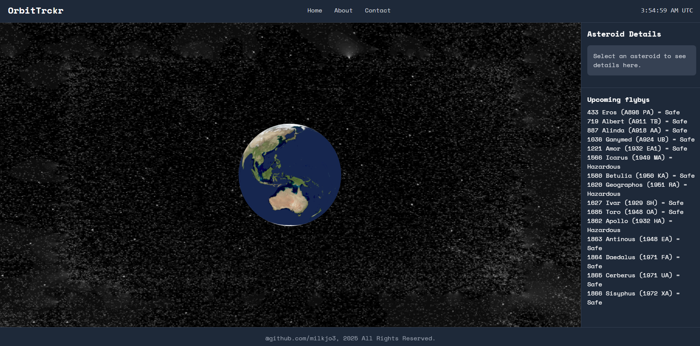

# OrbitTrckr

A React-based web application that utilizes the power of three.js to visualize NEO (Near-Earth Objects) as they pass by Earth and view their key data features like size, velocity, and closest approach distance. 

## Table of Contents

- [Features](#features)
- [Technologies](#technologies)
- [Installation](#installation)
- [Usage](#usage)
- [Folder Structure](#folder-structure)
- [License](#license)

## Features

Current Iteration; v.0.9.23.25



- NASA NeoW API Calls to gather NEOs through a certain timeframe
- Integrated three.js to visualize Earth orbiting around

#### Future development

- Integrate other NASA APIs for information gathering
- Generate factual information from RAG agents
- Enhance application's UI and Visuals

## Technologies

This project uses:

- [React](https://reactjs.org/)
- [Tailwind CSS](https://tailwindcss.com/)
- [PostCSS](https://postcss.org/)

## Installation

### Clone the repository:

```
git clone https://github.com/milkjo3/orbittrckr.git
cd orbittrckr
```

### Install dependencies:
```
npm install
```
or
```
yarn install
```

## Usage

### Run the development server:

```
npm run dev
```

### Folder Structure

```
orbittrckr/
├─ public/
│  └─ textures/          # Public assets like images or textures
├─ src/                  # Source code
├─ .env.example          # Example environment variables
├─ .gitignore            # Git ignore rules
├─ README.md             # Project documentation
├─ eslint.config.js      # ESLint configuration
├─ index.html            # Main HTML file
├─ package.json          # Project dependencies and scripts
├─ package-lock.json     # Locked dependency versions
├─ postcss.config.js     # PostCSS configuration
├─ tailwind.config.js    # Tailwind CSS configuration
└─ vite.config.js        # Vite build and dev server config
```

### License
This project is licensed under the MIT License.
